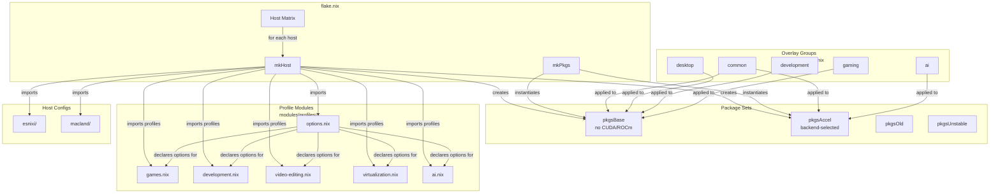
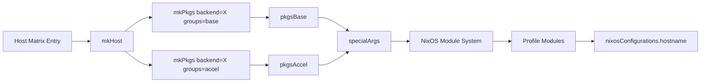
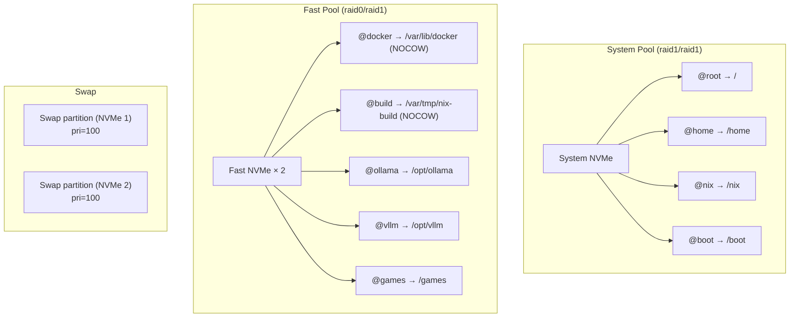

# Design Document: esnixi-flake-refactor

## Overview

This design describes the refactoring of a NixOS flake configuration from a monolithic, CUDA-polluted package set into a cleanly separated architecture with distinct package sets, grouped overlays, a profile module system, helper functions, and a declarative host matrix. It also covers storage layout redesign and service migration for the `esnixi` host.

The current `flake.nix` defines each host's package set inline with `cudaSupport = true`, `allowBroken = true`, a long flat overlay list, and a global Python override for `xformers`. This causes mass rebuilds of unrelated packages, poor binary cache hit rates, and tight coupling between gaming, desktop, and AI concerns.

The refactored architecture introduces:
- **`pkgsBase`**: A clean package set with no CUDA/ROCm flags, only common + desktop overlays
- **`pkgsAccel`**: A backend-selected package set (CUDA/ROCm/CPU) with AI overlays
- **`mkPkgs`/`mkHost`**: Helper functions for DRY package set and host creation
- **Overlay groups**: Named collections (`common`, `desktop`, `development`, `gaming`, `ai`) in `overlays/default.nix`
- **Profile modules**: Toggleable NixOS modules under `modules/profiles/` for games, development, video-editing, virtualization, and AI
- **Host matrix**: A top-level declarative mapping of hostnames to backends, profiles, and overlay groups
- **Storage redesign**: Two-pool Btrfs layout (System Pool + Fast Pool) for `esnixi`
- **Service migration**: Docker, Ollama, and vLLM moved to canonical FHS paths with dedicated users

### Design Rationale

The primary driver is **binary cache efficiency**. Setting `cudaSupport = true` globally forces rebuilds of thousands of packages that never use CUDA. By isolating CUDA into `pkgsAccel` consumed only by the AI profile, `pkgsBase` packages hit the NixOS binary cache directly.

The secondary driver is **maintainability**. The current flake has ~400 lines of inline package set definitions, duplicated overlay lists between hosts, and AI service config scattered across `esnixi/graphics.nix` and `configuration.nix`. The refactoring centralizes each concern into a single location.

## Architecture

### High-Level Component Diagram



### Data Flow



## Components and Interfaces

### 1. `lib/mk-pkgs.nix` — Package Set Factory

**Purpose**: Creates a fully instantiated nixpkgs package set given a system, backend selector, and list of overlay group names.

**Interface**:
```nix
# lib/mk-pkgs.nix
{ inputs, overlayGroups }:
{ system, backend, groups }:
```

**Parameters**:
| Parameter | Type | Description |
|-----------|------|-------------|
| `system` | string | Target system (e.g., `"x86_64-linux"`) |
| `backend` | string | One of `"cuda"`, `"rocm"`, `"cpu"` |
| `groups` | list of strings | Overlay group names to apply (e.g., `["common" "desktop"]`) |

**Returns**: A fully instantiated package set (`pkgs`).

**Behavior**:
- Always sets `allowUnfree = true` and `nvidia.acceptLicense = true`
- When `backend = "cuda"`: sets `cudaSupport = true` in config
- When `backend = "rocm"`: sets `rocmSupport = true` in config
- When `backend = "cpu"`: sets neither flag
- Resolves `groups` against the `overlayGroups` attribute set from `overlays/default.nix` and concatenates the resulting overlay lists
- Does NOT set `allowBroken = true` or `pythonRuntimeDepsCheck = false` globally
- Does NOT include the global `python3.packageOverrides` for xformers

**Design Decision**: `mkPkgs` lives in `lib/` rather than at the flake top level because it's a pure utility function with no host-specific logic. It receives `inputs` and `overlayGroups` via closure from the flake.

### 2. `mk-host.nix` — Host Configuration Factory

**Purpose**: Creates a complete `nixpkgs.lib.nixosSystem` configuration for a given host.

**Interface**:
```nix
# mk-host.nix
{ inputs, overlayGroups, mkPkgs }:
{ hostname, system, backend, profiles, extraModules ? [], homeImports ? [] }:
```

**Parameters**:
| Parameter | Type | Description |
|-----------|------|-------------|
| `hostname` | string | Host name (e.g., `"esnixi"`) |
| `system` | string | Target system architecture |
| `backend` | string | Acceleration backend (`"cuda"`, `"rocm"`, `"cpu"`) |
| `profiles` | attrset | Profile enable flags (e.g., `{ games = true; ai = true; }`) |
| `extraModules` | list | Additional NixOS modules to import |
| `homeImports` | list | Additional Home Manager imports |

**Behavior**:
1. Calls `mkPkgs` twice:
   - `pkgsBase`: `groups = ["common" "desktop" "development" "gaming"]` (no CUDA/ROCm flags, backend = `"cpu"`)
   - `pkgsAccel`: `groups = ["common" "ai"]` (with backend-selected acceleration)
2. Creates `pkgsOld` and `pkgsUnstable` without global CUDA/ROCm flags
3. Passes `pkgsBase`, `pkgsAccel`, `pkgsOld`, `pkgsUnstable`, and `inputs` as `specialArgs`
4. Sets `nixpkgs.pkgs = pkgsBase` so the default `pkgs` in modules is the clean base set
5. Imports:
   - `configuration.nix` (base system)
   - `./<hostname>/` directory modules (hardware, boot, networking, etc.)
   - `modules/profiles/options.nix`
   - Profile modules based on `profiles` flags
   - `extraModules`
6. Configures Home Manager with `useGlobalPkgs = true`, `useUserPackages = true`
7. Sets `my.acceleration.backend` and `my.profiles.*` options from the `profiles` attrset

**Design Decision**: `mk-host.nix` lives at the repository root (not in `lib/`) because it imports paths relative to the repo root (`./configuration.nix`, `./<hostname>/`). Placing it in `lib/` would require path gymnastics.

### 3. `overlays/default.nix` — Overlay Group Registry

**Purpose**: Exports named groups of overlay functions so that `mkPkgs` can select which overlays to apply.

**Interface**:
```nix
# overlays/default.nix
{ inputs }:
{
  common = [ ... ];
  desktop = [ ... ];
  development = [ ... ];
  gaming = [ ... ];
  ai = [ ... ];
}
```

**Group Assignments**:

| Group | Overlays |
|-------|----------|
| `common` | `nixgl`, `nix-static`, `helmfile`, `materialyoucolor`, `end-4-dots`, `fuzzel-emoji`, `dots-hyprland` |
| `desktop` | `keyboard-visualizer`, `wofi-calc`, `jetbrains-toolbox`, `latex`, `dots-hyprland-dp3-filter` |
| `development` | `debugpy` |
| `gaming` | `protontweaks` |
| `ai` | `comfyui`, `vllm`, `tensorrt`, `ollama`, `xformers-bin`, `bitsandbytes` |

**Design Decision**: The `dots-hyprland` overlay goes in `common` because both hosts use the Hyprland desktop. The `dots-hyprland-dp3-filter` overlay is esnixi-specific but placed in `desktop` since it's a display-related concern that doesn't hurt macland. Platform-specific overlays like `keyd`, `t2fanrd`, `tinydfr`, and `pipewire` remain in the macland host's `extraModules` or are applied conditionally.

### 4. `modules/profiles/options.nix` — Profile Option Declarations

**Purpose**: Declares all `my.profiles.*`, `my.acceleration.*`, and `my.paths.*` NixOS options in a single file.

**Options**:
```nix
{
  my.profiles.games.enable         # bool, default false
  my.profiles.development.enable   # bool, default false
  my.profiles.video-editing.enable # bool, default false
  my.profiles.virtualization.enable # bool, default false
  my.profiles.ai.enable            # bool, default false

  my.acceleration.backend          # enum ["cuda" "rocm" "cpu"], default "cpu"

  my.paths.ollama-models           # path, default "/opt/ollama/models"
  my.paths.vllm-models             # path, default "/opt/vllm/models"
  my.paths.docker-data             # path, default "/var/lib/docker"
  my.paths.build-scratch           # path, default "/var/tmp/nix-build"
}
```

### 5. Profile Modules

Each profile module is guarded by `lib.mkIf config.my.profiles.<name>.enable { ... }`.

#### `modules/profiles/ai.nix`

**Consumes**: `pkgsAccel` (from `specialArgs`), `my.paths.ollama-models`, `my.paths.vllm-models`, `my.acceleration.backend`

**Configures**:
- Ollama service with dedicated `ollama` user/group, models at `my.paths.ollama-models`, acceleration from `my.acceleration.backend`
- Ollama environment variables (parallel, flash attention, KV cache, VRAM limit)
- Ollama model creation oneshot service (qwen3:30b-tuned)
- vLLM service with dedicated `vllm` user/group, models at `my.paths.vllm-models`
- vLLM CUDA environment (cudatoolkit, cudnn, nvidia driver lib paths)
- HuggingFace token from sops secrets
- `systemd.tmpfiles.rules` for model directories
- Activation script for fixing permissions
- Firewall port 8000 for vLLM
- Open WebUI service
- AI-related system packages from `pkgsAccel` (vllm, cudatoolkit, torch, etc.)
- Conditional: vLLM only when `backend = "cuda"` (vLLM doesn't support ROCm well)

**Design Decision**: The entire Ollama + vLLM configuration currently split across `esnixi/graphics.nix`, `esnixi/vllm.nix`, and `esnixi/open-webui.nix` is consolidated into this single profile module. This is the biggest cleanup win — AI services no longer pollute the graphics config.

#### `modules/profiles/games.nix`

**Consumes**: `pkgsBase` (default `pkgs`)

**Configures**:
- Steam with Proton, remote play, dedicated server, gamescopeSession
- Proton-GE, protontricks
- ALVR for VR
- xpadneo controller support
- gamemode
- Gaming-related kernel sysctl and PAM limits
- Steam extra packages (mesa-demos, Qt Wayland, etc.)

**Design Decision**: Games profile uses `pkgsBase` — Steam and gaming packages don't need CUDA. The existing `esnixi/games.nix` and `macland/games.nix` host-specific files are preserved for host-specific gaming tweaks (e.g., different ALVR packages, heroic on macland).

#### `modules/profiles/development.nix`

**Consumes**: `pkgsBase` (default `pkgs`)

**Configures**:
- Development compilers and build tools (gcc, cmake, meson, ninja)
- Language runtimes (Node.js, OpenJDK, Python)
- AWS tools (awscli2, aws-cdk)
- ccache, nh
- Android development (adb)

**Design Decision**: Development tools don't need CUDA. The Home Manager `home/programs/development.nix` continues to handle user-level dev tools (VSCode, git config). The profile module handles system-level dev tools.

#### `modules/profiles/video-editing.nix`

**Consumes**: `pkgsBase` (default `pkgs`)

**Configures**:
- kdenlive
- ffmpeg-full
- mkvtoolnix-cli
- Additional video editing packages

#### `modules/profiles/virtualization.nix`

**Consumes**: `pkgsBase` (default `pkgs`), `my.paths.docker-data`

**Configures**:
- Docker with `storageDriver = "btrfs"`, `data-root` from `my.paths.docker-data`
- QEMU/KVM with swtpm
- libvirtd
- virt-manager
- KVM kernel modules
- Nested virtualization
- IOMMU kernel params

**Design Decision**: Docker's `data-root` is configurable via `my.paths.docker-data` so the storage layout migration can change it from `/home/docker` to `/var/lib/docker` without touching the profile module code.

### 6. Host Matrix (in `flake.nix`)

```nix
hosts = {
  esnixi = {
    system = "x86_64-linux";
    backend = "cuda";
    profiles = {
      games = true;
      development = true;
      video-editing = true;
      virtualization = true;
      ai = true;
    };
    extraModules = [
      ./esnixi/boot.nix
      ./esnixi/graphics.nix      # stripped to NVIDIA driver only
      ./esnixi/networking.nix
      ./esnixi/monitoring.nix
      ./esnixi/thunderbolt.nix
      ./esnixi/hyte-touch.nix
      ./esnixi/remote-desktop.nix
      ./esnixi/lvra.nix
      # external modules
      hyte-touch-infinite-flakes.nixosModules.hyte-touch
      protontweaks.nixosModules.protontweaks
      sops-nix.nixosModules.sops
    ];
    homeImports = [
      ./home/default.nix
      ./esnixi/hyprland.nix
    ];
  };
  macland = {
    system = "x86_64-linux";
    backend = "rocm";
    profiles = {
      games = true;
      development = true;
      video-editing = false;
      virtualization = true;
      ai = false;
    };
    extraModules = [
      ./macland/boot.nix
      ./macland/cpu.nix
      ./macland/graphics.nix
      ./macland/networking.nix
      ./macland/sound.nix
      ./macland/thunderbolt.nix
      nixos-hardware.nixosModules.apple-t2
      sops-nix.nixosModules.sops
      # macland-specific overlays applied via nixpkgs.overlays
    ];
    homeImports = [
      ./home/default.nix
      ./macland/hyprland.nix
    ];
  };
};
```

The flake generates `nixosConfigurations` via:
```nix
nixosConfigurations = builtins.mapAttrs (name: hostCfg: mkHost (hostCfg // { hostname = name; })) hosts;
```

### 7. Storage Layout (esnixi only)



**Design Decision**: Two equal-priority swap partitions replace the current mdadm raid0 swap. The kernel stripes writes across equal-priority swap devices natively, eliminating the mdadm dependency. `boot.swraid.enable` can be set to `false` after migration.

### 8. Helper Scripts

#### `scripts/rebuild-storage-layout.sh`

Destructive script that:
1. Prompts for confirmation before each destructive operation
2. Partitions fast NVMe drives (GPT: swap partition + Btrfs partition each)
3. Creates Fast Pool Btrfs filesystem with raid0 data / raid1 metadata
4. Creates subvolumes: `@docker`, `@build`, `@ollama`, `@vllm`, `@games`
5. Applies NOCOW to `@docker` and `@build` subvolumes
6. Logs all operations with timestamps
7. Supports `--dry-run` flag

#### `scripts/migrate-services.sh`

Conservative script that:
1. Stops Docker, Ollama, vLLM services
2. Rsyncs `/home/docker` → `/var/lib/docker`
3. Applies NOCOW attributes to target directories
4. Does NOT delete source data (admin removes manually)
5. Logs all operations with timestamps
6. Supports `--dry-run` flag

## Data Models

### Host Matrix Entry Schema

```nix
{
  system        : string;           # "x86_64-linux"
  backend       : enum;             # "cuda" | "rocm" | "cpu"
  profiles      : {
    games          : bool;
    development    : bool;
    video-editing  : bool;
    virtualization : bool;
    ai             : bool;
  };
  extraModules  : list of paths;    # NixOS modules to import
  homeImports   : list of paths;    # Home Manager imports
}
```

### Profile Options Schema (NixOS options)

```nix
{
  my.profiles.<name>.enable    : bool;          # default false
  my.acceleration.backend      : enum;          # "cuda" | "rocm" | "cpu", default "cpu"
  my.paths.ollama-models       : str;           # default "/opt/ollama/models"
  my.paths.vllm-models         : str;           # default "/opt/vllm/models"
  my.paths.docker-data         : str;           # default "/var/lib/docker"
  my.paths.build-scratch       : str;           # default "/var/tmp/nix-build"
}
```

### Overlay Group Schema

```nix
{
  common      : list of (self: super: { ... });
  desktop     : list of (self: super: { ... });
  development : list of (self: super: { ... });
  gaming      : list of (self: super: { ... });
  ai          : list of (self: super: { ... });
}
```

### Storage Layout Schema (esnixi)

| Pool | Drives | Data Profile | Metadata Profile | Subvolumes |
|------|--------|-------------|-----------------|------------|
| System Pool | 1× system NVMe | raid1 | raid1 | @root, @home, @nix, @boot |
| Fast Pool | 2× fast NVMe | raid0 | raid1 | @docker, @build, @ollama, @vllm, @games |

## Error Handling

### Build Failures

- **Overlay conflict**: If an overlay is accidentally included in both a group and inline, `mkPkgs` will apply it twice. The overlay grouping design ensures each overlay appears in exactly one group, and the inline overlay list in `flake.nix` is eliminated entirely.
- **Missing specialArg**: If a profile module references `pkgsAccel` but the host doesn't have it in `specialArgs`, the build fails with a clear "undefined variable" error. `mkHost` always passes `pkgsAccel` regardless of whether the AI profile is enabled.
- **Backend mismatch**: If `my.acceleration.backend = "rocm"` but `pkgsAccel` was built with `cudaSupport`, the AI profile would install wrong packages. `mkHost` ensures `pkgsAccel` backend matches `my.acceleration.backend`.

### Storage Script Failures

- Both scripts exit with non-zero status on any critical failure (`set -euo pipefail`)
- The rebuild script prompts before each destructive operation (partition, format)
- The migration script preserves source data — no data loss on failure
- Both scripts log with timestamps for post-mortem analysis

### Rollback Strategy

- **Phase 1** (flake refactoring): Pure git revert. The old `flake.nix` still works because no filesystem changes are required.
- **Phase 2** (storage layout): The rebuild script only touches the fast NVMe drives. The system pool is untouched. If the fast pool setup fails, the system boots normally from the system pool.
- **Phase 3** (service migration): The migration script preserves source data. Reverting the NixOS config to point Docker back to `/home/docker` restores the old behavior.

## Testing Strategy

### Why Property-Based Testing Does Not Apply

This feature is a NixOS/Nix configuration refactoring — it is Infrastructure as Code (IaC). The artifacts are declarative Nix expressions, shell scripts, and NixOS module options. There are no pure functions with variable input spaces suitable for property-based testing. The "inputs" are fixed host configurations, and the "outputs" are NixOS system closures.

Instead, correctness is verified through:

### Nix Evaluation Tests

- **`nix flake check`**: Validates that the flake evaluates without errors, all outputs are well-formed, and there are no infinite recursions or missing attributes.
- **`nix eval .#nixosConfigurations.esnixi.config.system.build.toplevel`**: Verifies the esnixi configuration evaluates to a valid system derivation.
- **`nix eval .#nixosConfigurations.macland.config.system.build.toplevel`**: Same for macland.

### Build Verification Tests

- **`nixos-rebuild build --flake .#esnixi`**: Full system build for esnixi. Verifies that all packages resolve, overlays apply correctly, and the system closure is complete.
- **`nixos-rebuild build --flake .#macland`**: Full system build for macland.
- These are the definitive correctness tests for NixOS configurations.

### Option Assertion Tests

Verify that the profile module system correctly wires options:
- When `my.profiles.ai.enable = true`, the system closure includes `ollama` and `vllm` packages
- When `my.profiles.ai.enable = false`, the system closure does NOT include `ollama` or `vllm`
- When `my.profiles.games.enable = true`, the system closure includes `steam`
- `pkgsBase` does NOT have `cudaSupport` in its config
- `pkgsAccel` for esnixi has `cudaSupport = true`
- `pkgsAccel` for macland has `rocmSupport = true`

These can be verified via `nix eval` expressions against the configuration.

### Script Testing

- **Dry-run validation**: Run both scripts with `--dry-run` and verify the output describes the expected operations.
- **Shellcheck**: Static analysis of both shell scripts for common errors.

### Integration Testing (Manual)

- **Phase 1**: Build both hosts, verify `nix flake check` passes, verify no CUDA packages in `pkgsBase`
- **Phase 2**: Run rebuild script on test drives, verify Btrfs layout
- **Phase 3**: Run migration script with `--dry-run`, then execute, verify services start at new paths

### Smoke Tests

- After `nixos-rebuild switch`, verify:
  - Ollama responds on port 11434
  - vLLM responds on port 8000
  - Docker daemon starts with btrfs storage driver
  - Steam launches
  - Hyprland desktop loads
